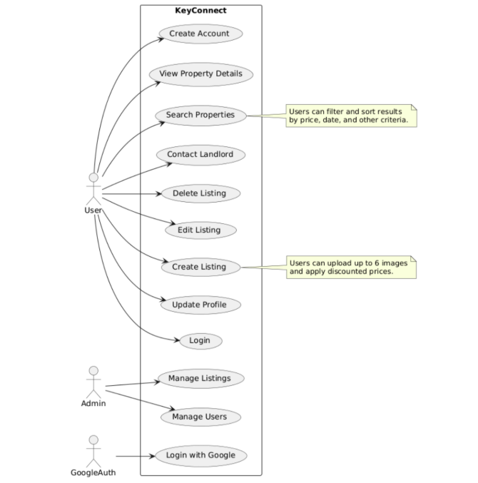
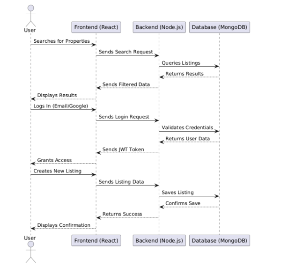
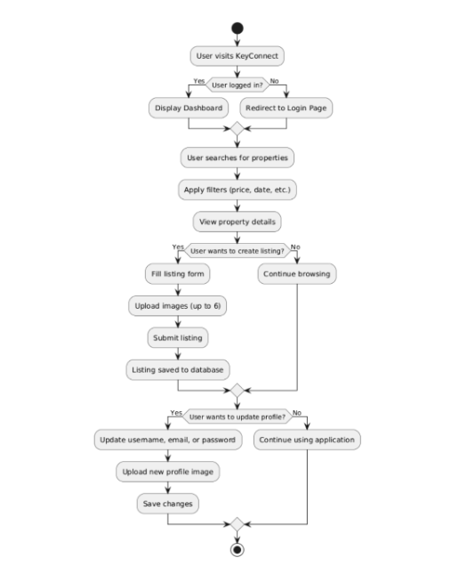
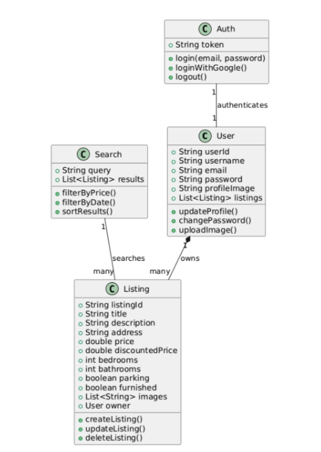

# 🔑 KeyConnect  
**Smart Real Estate Platform for Property Discovery and Direct Owner Connection**

---

## 📌 Overview  
KeyConnect is a web-based platform that simplifies property discovery by connecting users directly with property owners. It allows owners to list properties with detailed information, while users can search, filter, and explore listings based on their preferences.

The platform reduces dependency on intermediaries and improves transparency by enabling **direct communication between users and property owners**, making the process faster and more efficient.

---

## 🎯 Key Features  
- 🏠 Property listing by owners  
- 🔍 Search and filtering based on price, type, and location  
- 📍 Location-based property discovery  
- 📄 Detailed property information (price, amenities, type, etc.)  
- 📞 Direct connection between users and property owners  
- 👤 Simple and user-friendly interface  

---

## 🏗️ System Architecture  
KeyConnect follows a modular architecture:

- **User Module:** Search, filter, and view properties  
- **Owner Module:** Add and manage property listings  
- **Search Module:** Handles filtering and query processing  
- **Backend API:** Manages business logic and requests  
- **Database Layer:** Stores user and property data  

Designed for **scalability, efficient querying, and smooth user interaction**

---
## 🏗️ System Design & Diagrams  

### 🔹 Use Case Diagram  

### 🔹 Sequence Diagram  

### 🔹 Activity Diagram  

### 🔹 Class Diagram  

---

## 🛠️ Tech Stack  
- **Frontend:** React (for responsive and dynamic UI)  
- **Backend:** Node.js with Express (for REST API and server logic)  
- **Database:** MongoDB (for flexible and scalable data storage)  

---

## ⚙️ Key Technical Highlights  
- RESTful API design for scalable backend communication  
- Efficient filtering and querying of property data  
- Structured data modeling for real estate listings  
- Role-based interaction (Property Owner / User)  
- Optimized backend handling for better performance  

---

## 📊 Functional Flow  
1. Property owner lists a property with details  
2. User searches and filters properties  
3. User views selected property details  
4. User connects directly with the property owner  
5. Further interaction happens outside the platform  

---

## 🧪 Challenges  
- Designing efficient search and filtering mechanisms  
- Structuring flexible and scalable data models  
- Handling growing data efficiently  
- Maintaining a simple and intuitive UI  

---

## 📚 Learnings  
- Designing data-driven applications  
- Backend API design and optimization  
- Database structuring for real-world use cases  
- Importance of usability and simplicity in product design  

---

## 🔐 Code Availability  
> The source code is kept private.  
> This repository focuses on system design, architecture, and implementation approach.  
> Code can be shared upon request for academic or research evaluation.

---

## 🚀 Future Scope  
- 🗺️ Map-based property visualization  
- 💬 In-app chat system  
- 🤖 AI-based property recommendations  
- 🔔 Notification system  
- 📱 Mobile application support  

---

## 🎯 Target Users  
- Property buyers  
- Tenants  
- Property owners  

---

## ⭐ Why This Project  
KeyConnect solves a real-world problem in the real estate domain by enabling direct and transparent interaction between users and property owners. It demonstrates **system design, database modeling, and scalable backend development**.

--- 

## 📄 Documentation  
👉 https://drive.google.com/file/d/1iOFE5vNEv6sPZcSmiYW08GeJvKl4ri7T/view?usp=drivesdk
